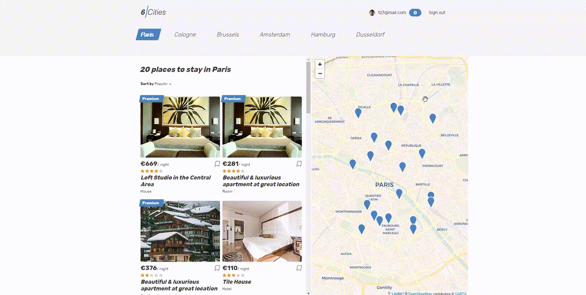
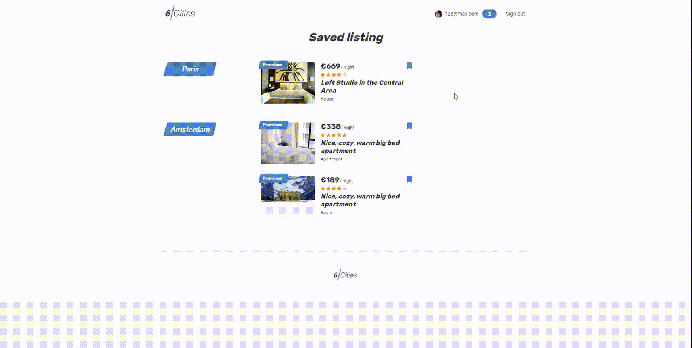
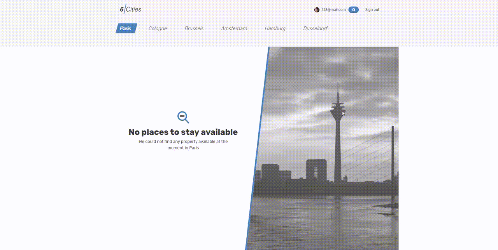

# Проект «Шесть городов»

---

### Основная функциональность

---

#### Вход по логину

---

#### Добавление коментация на странице карточки предложения

---

#### Добавление удаление в избранное

---

#### Заглушка если нет избранных предложений 

---

#### Заглушка если нет предложений по городу

---

#### Переход на страницу карточки предложения, разлогиневание, удаление из избранного

---

#### Сортировка карточек

---

#### Переключение предложений по городам

---
